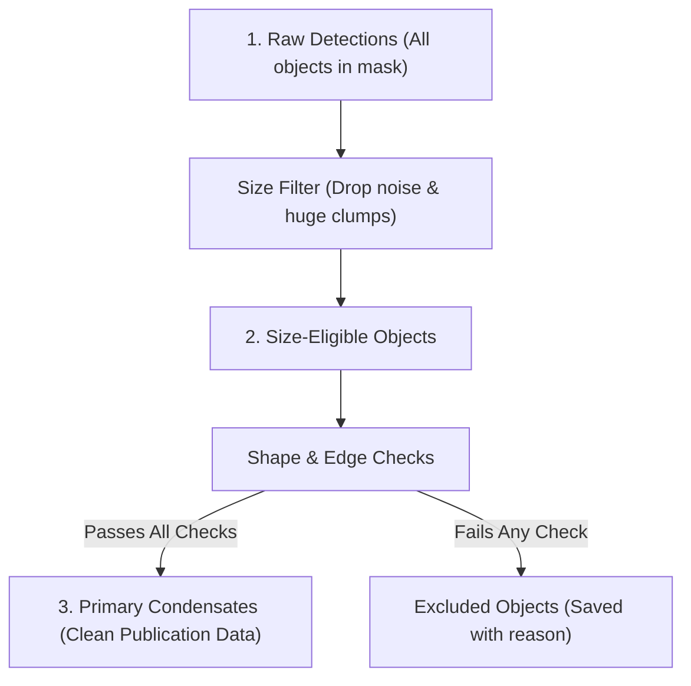

# Quality Control Pipeline

Not every detected blob is a clean, measurable condensate. Raw segmentations often include camera noise specks, cut-off objects touching the edges of the image, or artifacts.

To make sure your final analysis is clean and trustworthy, ExQt sorts objects into three tiers:



---

## The Three Tiers

### 1. Raw Detections (`_Output_Batch_3d.csv`)
Everything detected by the mask inside the nuclear ROI. This includes noise specks, cut-off blobs at the edge of the image, and multi-object clumps.

### 2. Size-Eligible Objects
Objects that fall within your chosen volume range ($V_{\min}$ to $V_{\max}$). This quickly filters out sub-resolution noise (too small) and giant segmentation mergers (too large).

### 3. Primary Condensates (`Result_Primary_Condensates.csv`)
The clean, high-confidence dataset used for your final plots and statistics. An object only becomes a **Primary Condensate** if it passes all quality checks:
- It does not touch the edges of the image.
- It is fully inside the nucleus (does not intersect the nuclear boundary).
- It has a continuous 3D structure across Z-slices.
- It has enough voxels in the core for radial analysis ($\ge 20$ voxels).

Objects that fail any check are saved into `Result_Excluded_Condensates.csv` with the exact reason recorded, so nothing is secretly deleted.

---

## Production Code: Classification Assignment (`postprocessing.py`)

Below is the production logic from [`postprocessing.py`](file:///C:/Users/franc/Desktop/ExQt_Rezim_A_Final/postprocessing.py) defining primary classification and segregating outputs:

```python
# --- EXCERPT FROM postprocessing.py: classify_and_filter_objects() ---

def filter_condensate_cohorts(df_raw: pd.DataFrame, min_vol: float, max_vol: float) -> tuple[pd.DataFrame, pd.DataFrame, pd.DataFrame]:
    """
    Segregates raw batch records into eligible, primary, and excluded cohorts.
    """
    # 1. Size-Eligible cohort
    df_eligible = df_raw[df_raw["volume_bio_um3"].between(min_vol, max_vol)].copy()
    
    # 2. Primary cohort (must satisfy all internal Mode A quality checks)
    is_primary = (
        df_eligible["primary_qc_valid"].fillna(False).astype(bool)
        & (~df_eligible["mode_a_object_touches_edge"].fillna(True).astype(bool))
        & (~df_eligible["mode_a_object_touches_roi_edge"].fillna(True).astype(bool))
        & (df_eligible["mode_a_z_topology_status"] == "pass")
    )
    df_primary = df_eligible[is_primary].copy()
    
    # 3. Excluded cohort (recorded with explicit audit trail)
    df_excluded = df_raw[~df_raw.index.isin(df_primary.index)].copy()
    
    return df_eligible, df_primary, df_excluded
```