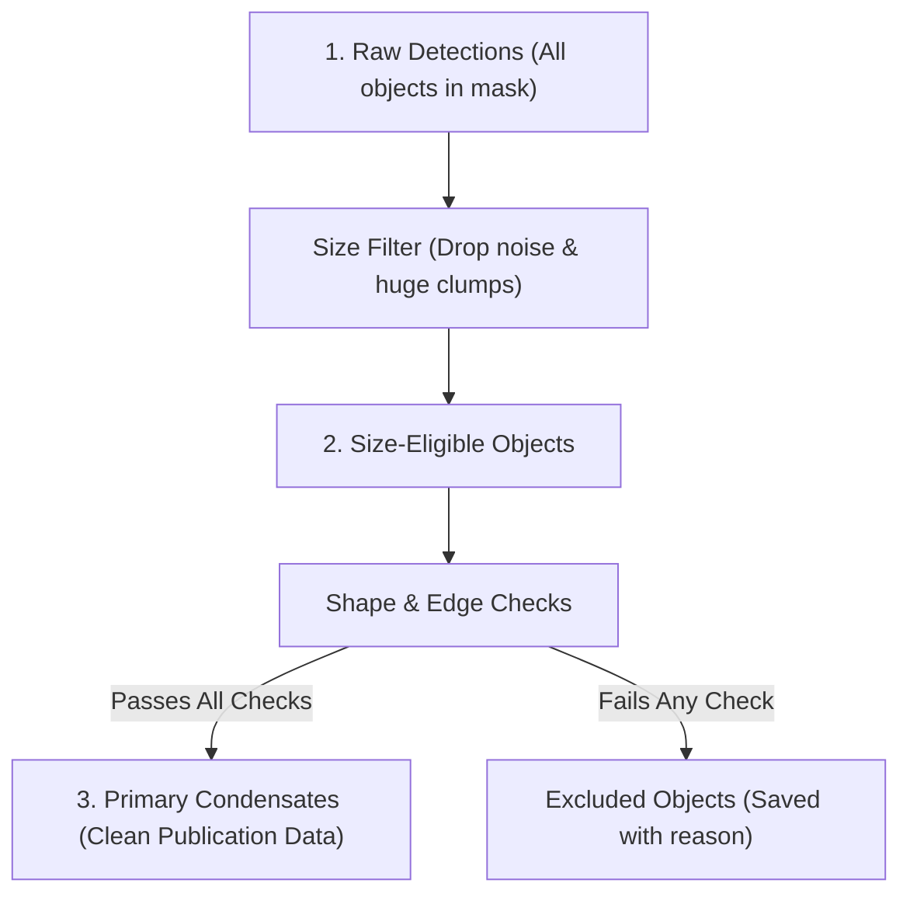

# Quality Control Pipeline

Not every detected blob is a clean, measurable condensate. Raw segmentations often include camera noise specks, cut-off objects touching the edges of the image, or artifacts.

To make sure your final analysis is clean and trustworthy, ExQt sorts objects into three tiers:

```mermaid
graph TD
    A["1. Raw Detections (All objects in mask)"] --> B["Size Filter (Drop noise & huge clumps)"]
    B --> C["2. Size-Eligible Objects"]
    C --> D["Shape & Edge Checks"]
    D -->|Passes All Checks| E["3. Primary Condensates (Clean Publication Data)"]
    D -->|Fails Any Check| F["Excluded Objects (Saved with reason)"]
```

---

## The Three Tiers

### 1. Raw Detections (`_Output_Batch_3d.csv`)
Everything detected by the mask inside the nuclear ROI. This includes noise specks, cut-off blobs at the edge of the image, and multi-object clumps.

### 2. Size-Eligible Objects
Objects that fall within your chosen volume range ($V_{\min}$ to $V_{\max}$). This quickly filters out sub-resolution noise (too small) and giant segmentation mergers (too large).

### 3. Primary Condensates (`<run>_Primary_Condensates.csv`)
The clean, high-confidence dataset used for your final plots and statistics. An object only becomes a **Primary Condensate** if it passes all quality checks:
- It does not touch the edges of the image/stack or the alignment padding (`touches_image_edge`), in every mode.
- It is not cut by the ROI boundary (`touches_roi_edge`), in every mode.
- Its stack was not aligned with overall status `REVIEW` (`alignment_status`).
- With Radial FA Profiling: continuous 3D structure across Z-slices, all layer FA valid and enough core voxels (`mode_a_primary_include`).

Objects that fail any check are saved into `<run>_QC_Excluded.csv` with the exact reason recorded, so nothing is secretly deleted.

---

## Implementation

The flags are computed per object in `Batch.process_condensates`; `postprocessing._prepare_reporting_frames` combines them:

`primary_qc_valid = size_eligible & fa_complete & mode_a_primary_include & alignment_ok & not_truncated`

(`fa_complete` and `mode_a_primary_include` are always `True` when Radial FA Profiling is off; `alignment_ok` = `alignment_status != "REVIEW"`; `not_truncated` = neither `touches_image_edge` nor `touches_roi_edge`). The partitioning report (`partitioning_plots`) uses only `primary_qc_valid` objects and K only where `K_valid`.

## Red Flags (warnings, nothing is removed)

`postprocessing.detect_red_flags` reports two warning signs in the GUI log (`RED FLAG: …`), in `*_metadata.json → red_flags` and in the Excel Summary (`Red flags`):

- more than 1000 objects in one nucleus (`filename`, `cell_id`) – `objects_per_nucleus`;
- per-file median object size below 50 voxels (pixels in 2D) – `median_size_below_min`.

Both usually mean over-segmentation or noise. Check the mask, `min_voxels` (default 5) and the expansion factor before interpreting any number from such a run.

## Known Limitation: Size Selection of the Primary Set

With Radial FA Profiling the primary set requires a valid core FA (`min_core_voxels`, default 20). The core holds only about 4 % of an object's volume, so in practice objects need roughly 500 or more voxels to qualify. The primary set therefore over-represents large objects, and statistics from it describe that subset, not all condensates. The Excel Summary row `Primary selection bias` (`postprocessing.primary_selection_summary`) reports the number and the median size of primary vs size-eligible excluded objects for every run.
