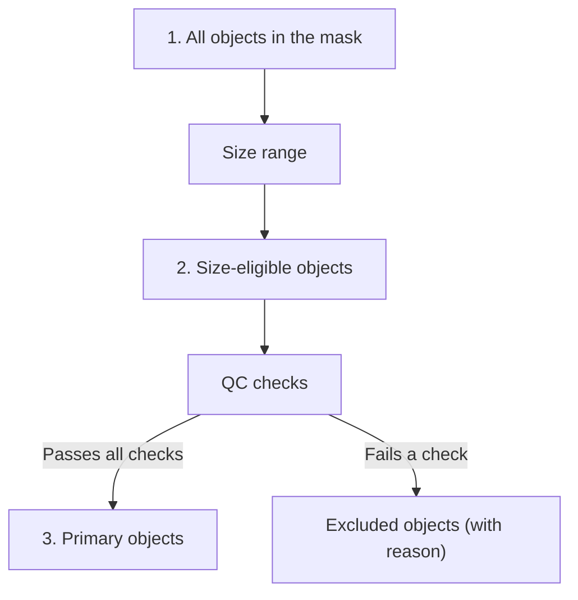

# Quality Control Pipeline

ExQt sorts the objects of a run into three groups:

```mermaid
graph TD
    A["1. All objects in the mask"] --> B["Size range"]
    B --> C["2. Size-eligible objects"]
    C --> D["QC checks"]
    D -->|Passes all checks| E["3. Primary objects"]
    D -->|Fails a check| F["Excluded objects (with reason)"]
```

---

## The Three Groups

### 1. All Objects (`<folder>_Output_Batch_3d.csv`)
Every connected component of the mask inside the ROI that is larger than the noise filter.

### 2. Size-Eligible Objects
Objects within the chosen size range (Min size – Max size).

### 3. Primary Objects (`<run>_Primary_Condensates.csv`)
The objects used for the summary statistics and plots. An object is primary if it is size-eligible and:

- does not touch the edge of the image/stack or the alignment padding (`touches_image_edge`);
- is not cut by the ROI boundary (`touches_roi_edge`);
- does not come from a stack whose alignment status is `REVIEW` (`alignment_status`);
- with Radial FA Profiling: passes the Z-topology check, has all layer FA valid and enough core voxels (`mode_a_primary_include`).

Size-eligible objects that fail a check are saved in `<run>_QC_Excluded.csv` with the reason.

---

## Implementation

The flags are computed per object in `Batch.process_condensates` and combined in `postprocessing._prepare_reporting_frames`:

`primary_qc_valid = size_eligible & fa_complete & mode_a_primary_include & alignment_ok & not_truncated`

(`fa_complete` and `mode_a_primary_include` are always `True` when Radial FA Profiling is off.)

---

## Warnings (nothing is removed)

ExQt writes a warning to the log (`RED FLAG: …`), to `*_metadata.json → red_flags` and to the Excel Summary when:

- one nucleus contains more than 1000 objects (`objects_per_nucleus`);
- the median object size in a file is below 50 voxels (pixels in 2D) (`median_size_below_min`).

Both can indicate over-segmentation or noise; check the mask, `min_voxels` and the expansion factor.

---

## Known Limitation: Size Selection

With Radial FA Profiling the primary set requires a valid core FA (`min_core_voxels`, default 20). The core holds only about 4 % of an object's volume, so in practice objects need roughly 500 voxels or more. Statistics of the primary set describe these larger objects, not all objects. The Excel Summary row `Primary selection bias` reports the number and median size of primary and excluded objects for each run.
