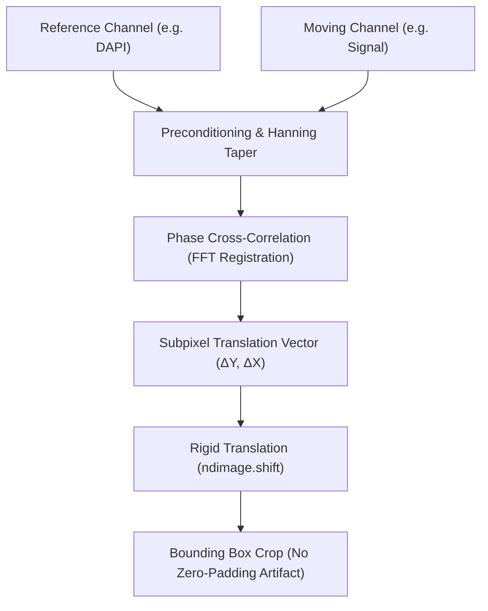

# Multi-Channel Stack Aligner (Drift & Aberration Correction)

In sequential multi-channel 3D confocal acquisitions, spatial misalignment between channels frequently arises due to **thermal drift**, **piezo stage backlash**, or **chromatic aberration** across emission wavelengths.

If an antibody channel (e.g., SON speckles in green) is misaligned with the nuclear counterstain (e.g., DAPI in blue) by even 200–500 nm, condensates located near the nuclear periphery will artificially cross into the background, corrupting partition coefficients and triggering spurious QC exclusion.

---

## Subpixel Registration Algorithm

The `stack_aligner.py` module performs rigid translation estimation in Fourier space using **Phase Cross-Correlation** (`skimage.registration.phase_cross_correlation`):



### Steps in the Pipeline:
1. **Edge-Tapering**: Applies 2D Hanning window tapering along plane boundaries to suppress high-frequency spectral leakage caused by rectangular image edges in the FFT.
2. **Phase Correlation**: Estimates the rigid translation vector $(\Delta Y, \Delta X)$ with subpixel accuracy ($1/100$th of a pixel).
3. **Bounding Box Cropping**: Translates the image and **crops** the overlapping bounding box across all channels. **Critically, ExQt does NOT pad shifted edges with zeros**, because artificial zeros corrupt background noise calculations.

---

## Production Code: Plane Preconditioning & Shift Validation (`stack_aligner.py`)

Below is the production implementation from [`stack_aligner.py`](file:///C:/Users/franc/Desktop/ExQt_Rezim_A_Final/stack_aligner.py) demonstrating plane conditioning and post-shift correlation validation:

```python
# --- EXCERPT FROM stack_aligner.py ---

def _prepare_plane(plane: np.ndarray, config: AlignmentConfig) -> np.ndarray | None:
    """
    Preconditions a 2D optical section for FFT phase cross-correlation.
    Applies percentile clipping, optional bandpass filtering, and Hanning edge-tapering.
    """
    image = np.asarray(plane, dtype=np.float64)
    finite = np.isfinite(image)
    if not finite.any():
        return None
    image = np.where(finite, image, np.median(image[finite]))
    
    # Clip extreme hot/dead pixels (1st to 99th percentile)
    low, high = np.percentile(image, (1, 99))
    if not np.isfinite(low) or not np.isfinite(high) or high <= low:
        return None
    image = np.clip(image, low, high)

    # Optional bandpass filter to highlight structural texture
    if config.highpass_sigma > 0:
        image = image - ndi.gaussian_filter(image, config.highpass_sigma)
    if config.smooth_sigma > 0:
        image = ndi.gaussian_filter(image, config.smooth_sigma)

    # Normalize intensity to zero mean, unit variance
    std = float(np.std(image))
    if not np.isfinite(std) or std < config.min_texture_std:
        return None
    image = (image - float(np.mean(image))) / std

    # Apply 2D Hanning edge taper to eliminate FFT boundary discontinuity
    if config.edge_taper and min(image.shape) >= 4:
        image = image * np.outer(np.hanning(image.shape[0]), np.hanning(image.shape[1]))
        
    return image


def _correlation(reference: np.ndarray, moving: np.ndarray, shift_yx: np.ndarray) -> float:
    """
    Computes Pearson correlation coefficient strictly over the overlapping valid pixels
    after applying the candidate subpixel translation.
    """
    shifted = ndi.shift(
        moving, tuple(float(v) for v in shift_yx),
        order=1, mode="constant", cval=np.nan, prefilter=False
    )
    valid = np.isfinite(reference) & np.isfinite(shifted)
    if np.count_nonzero(valid) < 16:
        return np.nan
        
    a = reference[valid].astype(float)
    b = shifted[valid].astype(float)
    a -= a.mean()
    b -= b.mean()
    denom = np.sqrt(np.sum(a * a) * np.sum(b * b))
    return float(np.sum(a * b) / denom) if denom > 0 else np.nan
```

### Explanatory Breakdown:
- **`np.outer(np.hanning(...), np.hanning(...))`**: Multiplies the image by an elliptical window that smoothly ramps intensities to zero at the perimeter, eliminating circular convolution artifacts.
- **`cval=np.nan` in `ndi.shift`**: Shifted non-overlapping border pixels are filled with `NaN` rather than zero, ensuring that the correlation coefficient is computed strictly over real intersecting biological structures.

---

## Methodological Background & Inspiration

The multi-channel 3D stack alignment strategy in `stack_aligner.py` is inspired by and adapted from the MATLAB **[3D-Aligner](https://github.com/suzukilabmcardle/3D-Aligner)** developed by the **Suzuki Lab at the McArdle Laboratory for Cancer Research** ([suzukilabmcardle/3D-Aligner](https://github.com/suzukilabmcardle/3D-Aligner)).

In ExQt, the core concepts were re-engineered and implemented natively in Python using `skimage.registration.phase_cross_correlation` and `scipy.ndimage`, augmented with:
1. **Automated Reference Quality Scoring**: Dynamic selection of the optimal structural reference channel (`ChannelDetectionWorker`).
2. **Spectral Leakage Suppression**: Edge-preserving 2D Hanning window preconditioning to eliminate Fourier border discontinuities.
3. **Canvas Expansion (`expand_canvas=True`)**: Expanding image bounding boxes to ensure shifted stacks retain all peripheral signals without zero-padding corruption.
4. **Synchronized Mask Alignment**: Rigid transformation validation and synchronized translation applied automatically to corresponding binary/labeled `*_Mask.tif` stacks.
